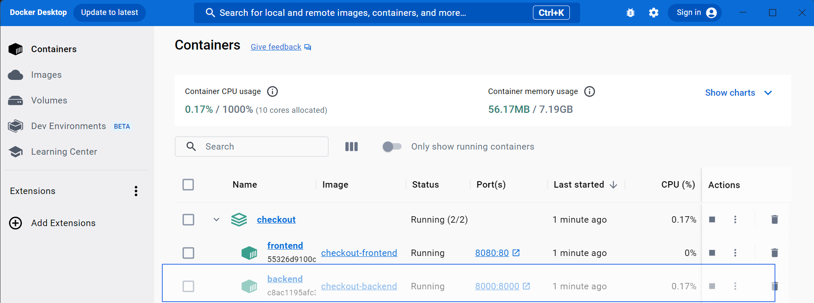
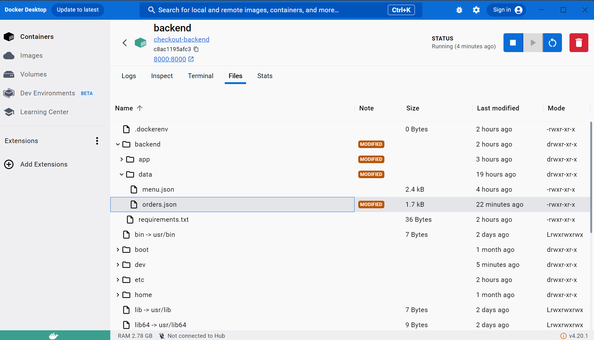
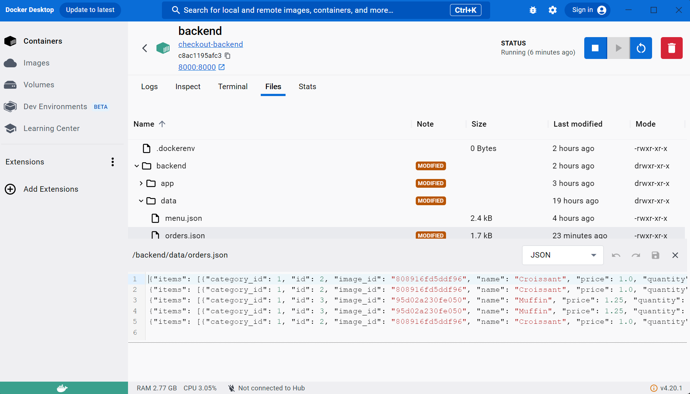

# Restaurant Order System

This project is a simple restaurant checkout order system that uses a **Vue.js** frontend, **FastAPI** backend, and is containerized with **Docker**. The app allows users to view menu items, add them to the cart, proceed to checkout, and submit the order.

## Prerequisites

- **Node.js** (for frontend development)
- **Docker** and **Docker Compose** (for containerization)
- **Python** (for backend development)
- **Vite** (for frontend build tool)

### Install Dependencies

Before setting up the project, make sure you have **Node.js** and **Docker** installed on your system.

1. **Node.js**: [Download Node.js](https://nodejs.org/).
2. **Docker**: [Download Docker](https://www.docker.com/get-started).

## Project Setup

Follow the steps below to set up and run the project.

### 1. Clone the Repository

```bash
git clone <https://github.com/jacobpfondevida/checkout.git>
cd <checkout>
```

### 2. Configure Environment Variables

For the frontend to communicate with the backend, you need to set the API URL. Create a `.env` file in the `frontend/` directory and add the following:

```env
VITE_API_BASE_URL=http://localhost:8000
```

For the backend, make sure the API is set to run on port 8000. This is already configured in the `docker-compose.yml` file.

### 3. Running the Application Using Docker

1. In the root of your project, run the following command to build and start the containers:

```bash
docker-compose up --build
```

This will:

- Build the frontend and backend containers.
- Start both the frontend and backend services.
- Expose the frontend on `http://localhost:8080` and the backend on `http://localhost:8000`.

2. Access the app:

- Frontend: [http://localhost:8080](http://localhost:8080)
- Backend Docs: [http://localhost:8000](http://localhost:8000/docs)

### 4. Frontend Development (Optional)

To develop the frontend locally without Docker:

Navigate to the frontend folder then run the frontend development server:

```bash
cd frontend
npm run dev
```

This will start a local development server on `http://localhost:5173`.

### 5. Backend Development (Optional)

To run the backend locally:

1. Navigate to backend folder:

```bash
cd backend
```

2. Create a virtual environment:

```bash
python -m venv .venv
```

3. Activate the Python virtual environment:

```bash
source .venv/bin/activate  # On Windows: venv\Scripts\activate
```

4. Install dependencies:

```bash
pip install -r requirements.txt
```

5. Run with FastAPI:

```bash
fastapi dev app/main.py
```

This will run the backend at `http://127.0.0.1:8000`.

### 6. Viewing orders

To view orders placed, use Docker desktop:



Select backend, then navigate to Files.
In `backend/data/` there will be a file called `orders.json` that stores successful orders.



`orders.json` will look like this:



### 7. Closing Docker

To close Docker, navigate back to the terminal running Docker and press `CTRL+C`.

---


## Technologies Used

- **Frontend**: TypeScript, Vue, Vite, TailwindCSS, Pinia, Axios
- **Backend**: FastAPI, Python
- **Containerization**: Docker
